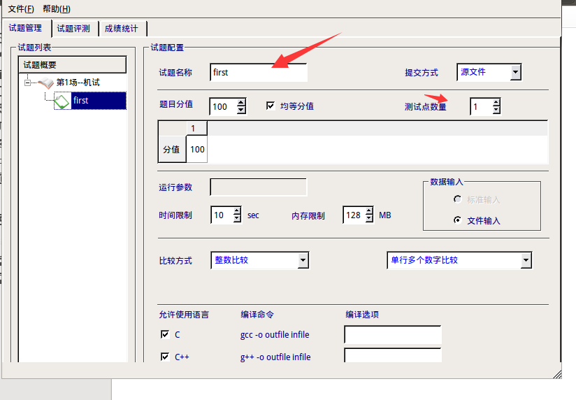
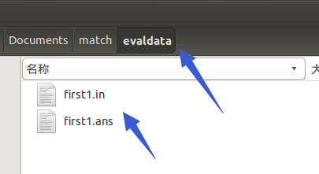
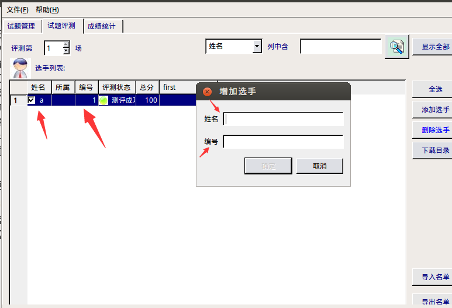
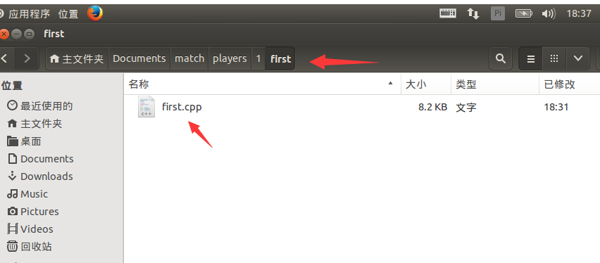
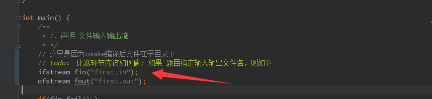
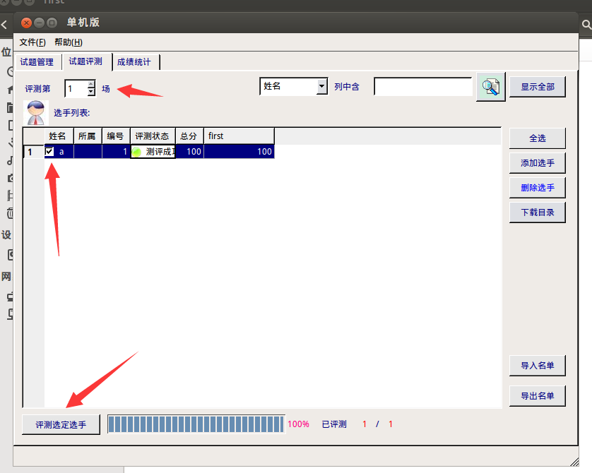

# arbiter 评测软件使用
  
    安装noi_linux 1.4

## 1、新建考试，选择目录 
- 注意随时保存，包括后续任何步骤

## 2、新建试题
- 

## 3、试题测试数据拷贝目录
-  evaldata目录/ 试题名称+编号    （编号就是试题创建 的测试点编号 1-10）
- .in  表示输入；.ans 表示 核对的答案
- 

## 4、添加选手，注意编号
- 

## 5、选手提交的待测评源码
- players 目录/ 选手编号/试题名称/ 源码文件-->试题名称.cpp
- 
- 注意源码中 输入输出文件的指定 ：试题名.in / 试题名.out
- 

## 6、测评
- 

