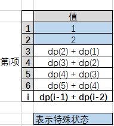
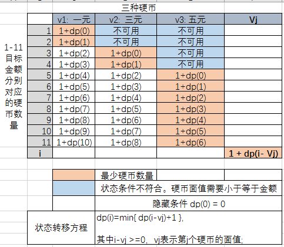
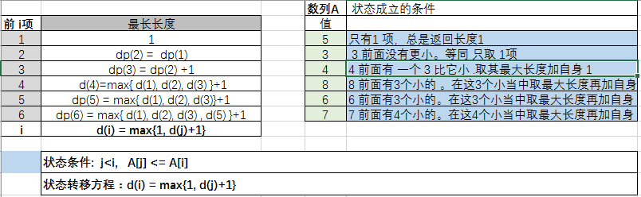

# 动态规划 Dynamic Programming 
Programming 理解为表格，规划、设计

## 绘制表格

## 状态转移方程

## 典型问题

### 一、斐波那契数列
- 问题：斐波那契数量是最前面两项分别为1,2的数列，从第三项开始，每一项等于前两项之后，比如1,2,3,5,8...， 求第n项（2 < n < 100000）的值

- 绘制表格： 寻找状态 

- 子问题和状态 比较直观：某项的数值等于前两项之和。 当前项的状态就是这个数组，依赖与前两项的状态，不依赖后面或其他项。
  
  状态条件：其中最前面两项状态是特殊状态，指定了1,2
  
- 状态转移方程： `dp(i) = dp(i-1) + dp(i-2)` ；当i 为1,2时，分别返回1,2。

- 斐波那契数列用动态规划概念求解虽然杀鸡用牛刀，但是对理解状态和 状态转移方程的概念很有帮助 ，可以直接推导出递归。

- [迭代求解代码](fibonacci.cpp)
- [递归求解代码](fibonacci_recursive.cpp)

### 二、[硬币问题](http://www.hawstein.com/posts/dp-novice-to-advanced.html)
- 问题： 如果我们有面值为1元、3元和5元的硬币若干枚，如何用最少的硬币凑够11元？

- 绘制表格，寻找状态。 

- 分拆为子问题：

  每个金额 ，假如必须使用某种硬币 ，则其最少硬币数量 为 1（这个必须用的硬币就代表 1个） 加上 扣除该面值后余额的 最少硬币数量。
 
  因此，当前金额的最少硬币数量这个状态，依赖于 扣除当前硬币面值后余额的 最少硬币状态。
  
  状态条件：1、0 金额返回 0 个硬币；2、当前硬币面值需小于等于 当前金额。
  
- 状态转移方程: `dp(i) = min{ dp(i-vj)+1 }` (i 为凑够的金额数; vj表示第j个硬币的面值; i-vj >=0 需要成立（表示该面值硬币可用))

- [根据规划表格行列的迭代求解代码](coins.cpp)
- [根据状态转移方程的递归求解代码](coins_recurive.cpp)

### 三、[LIS 问题](http://www.hawstein.com/posts/dp-novice-to-advanced.html) 
- 问题：一个序列有N个数：A[1],A[2],…,A[N]，求出最长升序子序列的长度。 (讲DP基本都会讲到的一个问题LIS：longest increasing subsequence)

  比如`5，3，4，8，6，7` 这个6元素的数列，最长子序列是`3,4,6,7`，长度为4
  
- 绘制表格，递推寻找状态 。

- 拆分子问题，选中状态和迁移方程：

  前1个数的LIS长度d(1)=1 :序列：5，----总是1
  
  前2个数的LIS长度d(2)=1 :序列：3；----3 前面没有比3小的。所以等同取1项 d(1)
  
  前3个数的LIS长度d(3)=2 :序列：3，4；----4 前面有 1个 比它小的3，所以取这个小的最长+1 d(3)=d(2)+1 
  
  前4个数的LIS长度d(4)=3 :序列：3，4，8； ----8 前面比它小的有 3个 数，所以分别取这3项的最长 +1(自己一个) d(4)=max{d(1),d(2),d(3)}+1=3
  
  状态条件：1、 取1项 为1；2、当前项数值 前面有几个比自己小，就取这几个的 最大长度的 最大值 + 1。如果么有比自己小的，就等同取1项 为1.
  
- 状态转移方程 ：`d(i) = max{1, d(j)+1}` ； 条件 `j<i,   A[j] <= A[i]`

- [迭代求解](lis.cpp)
- [递归求解](lis_recursive.cpp)
  

  