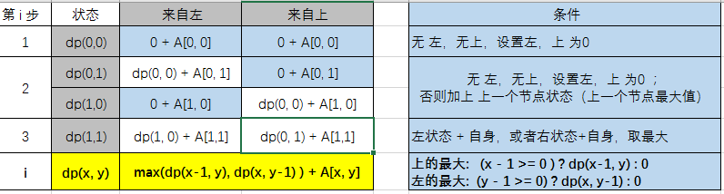
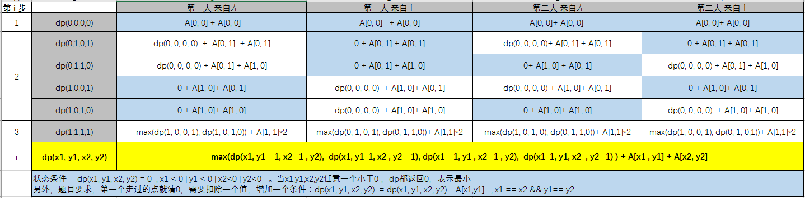

# 解题思路

## 思考

### 先后求两次最大值
 
#### 1、排列组合

- 从A点出发，每次都有两个方向行进，向右或向下。通过递归可以记录每种可能的路径。然后每个路径汇总节点值，再对路径汇总值求最大。    
- 至于第二次走之前，需要清理掉第一次获得路径上节点的数值为0，然后再来一遍。
- 算法简单，但是复杂度是2的14次方，并且还得是两遍。

#### 动态规划
- 不用先排列组合获得所有路径并保存每个路径。

- 绘制单次行走 规划表格，寻找状态 ， 缩减问题规模为2*2 矩阵 

- 行走方向是要么向右，要么向下。反过来说，一个点要么来自上面，要么来自左边。

- 状态迁移方程：`dp(x, y) = max(dp(x-1, y), dp(x, y-1) ) + A[x, y] ` 。
   
  条件: 1、上的最大:   `(x - 1 >= 0 ) ? dp(x-1, y) : 0`; 2、左的最大:  `(y - 1 >= 0) ? dp(x, y-1) : 0`
 

- 在递归行进时可直接获取该节点后续路径的最大值。并缓存这个最大值，下次不用重新计算。 返过来递推也行。
- 由于需要清理第一次路径的节点数值为0， 需要记录这个最大值的来源途径。在递归行进时，需要取后续两种方向的一个最大节点，因此，在判断最大后续节点时，即可同时记录路径。路径应链表表示

- [实现代码](grid_digital.cpp)

- 上述方法是分别做两次dp 做最大(优)计算，但实际测试下来，两次分别最优 却不能保障两次合计最优。比如第三个测试点数据

        0 0 2 3 0 0 0
        0 0 3 0 0 0 0
        0 0 3 0 0 0 0
        0 0 0 0 0 0 0
        0 0 0 0 4 0 0
        0 0 0 0 4 0 0
        0 0 2 0 4 0 0
    
输入

    7
    1 3 2
    1 4 3
    2 3 3
    3 3 3
    5 5 4
    6 5 4
    7 3 2
    7 5 4
    0 0 0

   期望结果 25 。但现在是23 。两次dp， 第一次20，清零后，整个上面只剩下 3,2。而这两个是凑不成一条路线的。只能选3 。先后两次最优计算只能获得23.
   
   从两次合计结果为最优前提看，路径尽量覆盖更多的数据点，确实是25

- 所以 先后两次 最优计算再合并 ，存在bug， 不符合 要求两次合计最大的 题目要求。

###　同时计算两次最优，等同二人一起行走
- 绘制双人行走　规划表格，寻找状态。

- 相对单人行走的状态表述是 x，y 一个点，双人行走 每一步 都是 2个点：x1,y1,x2,y2

- 状态迁移方程 ： 

      dp(x1, y1, x2, y2) = max(dp(x1, y1 - 1, x2 -1 , y2),  dp(x1, y1-1, x2 , y2 - 1), 
                             dp(x1 - 1, y1 , x2 -1 , y2),  dp(x1-1, y1, x2  , y2 -1) ) + A[x1 , y1] + A[x2, y2] 
- 状态条件：

    1、当x1,y1,x2,y2任意一个小于0 ，dp都返回0，表示最小 : `dp(x1, y1, x2, y2) = 0  ; x1 < 0 | y1 < 0 | x2<0 | y2<0` 。
    
    2、另外，题目要求，第一个走过的点就清0，需要扣除一个值，增加一个条件：
        `dp(x1, y1, x2, y2)  = dp(x1, y1, x2, y2) - A[x1,y1]   ; x1 == x2 && y1== y2` 

- [迭代实现代码](4darray.cpp)

## 相关知识点
- 算法的复杂度计算和评估
- 动态规划 ：[知乎上关于动态规划的解答](https://www.zhihu.com/question/23995189) ;[动规练习](../concept/DynamicProgramming)
- 递归
- 递推
- 链表

## 练习
- 暴力法：列出大O复杂度，排列组合所有路径。再有路径求得解。输出消耗时间（秒）