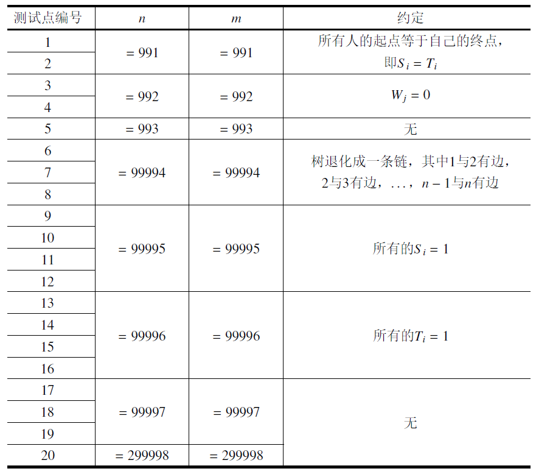

# 天天爱跑步

##  来源：[NOIP 2016 提高组 Day 1 第二题](https://www.vijos.org/p/2004)

## 描述

小C同学认为跑步非常有趣，于是决定制作一款叫做《天天爱跑步》的游戏。《天天爱跑步》是一个养成类游戏，需要玩家每天按时上线，完成打卡任务。
这个游戏的地图可以看作一棵包含n个结点和n - 1条边的树，每条边连接两个结点，且任意两个结点存在一条路径互相可达。树上结点编号为从1到n的连续正整数。
现在有m个玩家，第i个玩家的起点为Si，终点为Ti。每天打卡任务开始时，所有玩家 在第0秒 同时从 自己的起点 出发，以 每秒跑一条边 的速度，不间断地沿着最短路径向着 自己的终点 跑去，跑到终点后该玩家就算完成了打卡任务。（由于地图是一棵树，所以每个人的路径是唯一的）
小C想知道游戏的活跃度，所以在每个结点上都放置了一个观察员。在结点j的观察员会选择在第Wj秒观察玩家，一个玩家能被这个观察员观察到当且仅当该玩家在第Wj秒也 正好 到达了结点j。小C想知道每个观察员会观察到多少人？
注意： 我们认为一个玩家到达自己的终点后该玩家就会结束游戏，他不能等待一段时间后再被观察员观察到。即对于把结点j作为终点的玩家：若他在第Wj秒前到达 终点，则在结点j的观察员 不能观察到 该玩家；若他 正好 在第Wj秒到达终点，则在结点j的观察员 可以观察到 这个玩家。

## 格式

### 输入格式

第一行有两个整数n和m。其中n代表树的结点数量，同时也是观察员的数量， m代表玩家的数量。
接下来n - 1行每行两个整数u和v，表示结点u到结点v有一条边。
接下来一行n个整数，其中第j个整数为Wj，表示结点j出现观察员的时间。 接下来m行，每行两个整数Si和Ti，表示一个玩家的起点和终点。
对于所有的数据，保证1 <= Si, Ti <= n，0 <= Wj <= n。

### 输出格式

输出1行n个整数，第j个整数表示结点j的观察员可以观察到多少人。

## 样例1
###　样例输入1
6 3
2 3
1 2
1 4
4 5
4 6
0 2 5 1 2 3
1 5
1 3
2 6

### 样例输出1
2 0 0 1 1 1

##　样例2
### 样例输入2
5 3
1 2
2 3
2 4
1 5
0 1 0 3 0
3 1
1 4
5 5

### 样例输出2
1 2 1 0 1

## 限制

每个测试点时限2秒。
### 【子任务】
每个测试点的数据规模及特点如下表所示。提示：数据范围的个位上的数字可以帮助判断是哪一种数据类型。

## 提示

###【样例1说明】
- 对于1号点，W1=0，故只有起点为1号点的玩家才会被观察到，所以玩家1和玩家2被观察到，共2人被观察到。
- 对于2号点，没有玩家在第2秒时在此结点，共0人被观察到。
- 对于3号点，没有玩家在第5秒时在此结点，共0人被观察到。
- 对于4号点，玩家1被观察到，共1人被观察到。
- 对于5号点，玩家2被观察到，共1人被观察到。
- 对于6号点，玩家3被观察到，共1人被观察到。

## [解题思路](思路.md)